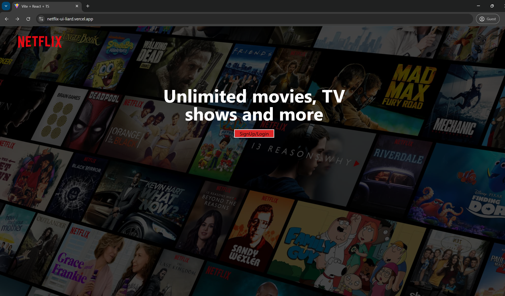
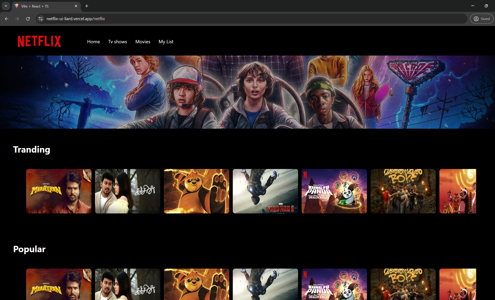

# 🎬 MovieStream - Tailwind React App with BunnyDB

Welcome to **MovieStream**, a sleek movie streaming web app built with **React** and **Tailwind CSS**, powered by **BunnyDB** for movie data management and deployed live on **Vercel**!

---

## 🎥 Features

- 🌐 Fully deployed React frontend on **Vercel**
- 🎬 Stream movies directly in-app with HTML5 video support
- ⚙️ Backend powered by **BunnyDB** for movie data
- 📽️ Stylish dark UI using **Tailwind CSS**
- 🖼️ Logo + animated marquee + nav bar
- 🎞️ Video autoplay background
- 🖥️ Responsive, modern layout

---

## 🛠️ Tech Stack

- **Frontend**: React + Tailwind CSS
- **Backend**: BunnyDB
- **Deployment**: Vercel

---

## 🧑‍💻 How It Works

- Movie metadata and file paths are fetched from **BunnyDB**
- Users can interact with a stylish UI to choose and watch movies
- Tailwind provides fast styling and responsiveness

---

## 📸 Preview

---

## 🌐 Deployment Setup

1. Push the code to GitHub
2. Connect the repo to **Vercel**
3. Set build settings:
   - **Build Command**: `npm run build`
   - **Output Directory**: `build/`
4. Add your BunnyDB API keys/environment variables if needed

---

## 💡 Coming Soon

- User login/auth with JWT
- Add to favorites or watchlist
- Dynamic category browsing (e.g., Action, Romance)
- Integrated search and filters
- Adaptive streaming quality

---

## 🙌 Author

- **Name**: Yogi  
- **Project**: Tailwind Movie Streaming App  
- **Backend**: BunnyDB  
- **Hosted on**: Vercel

---

## 🤝 Thanks

- [Tailwind CSS](https://tailwindcss.com/)
- [React](https://reactjs.org/)
- [Bunny.net & BunnyDB](https://bunny.net/)
- [Vercel](https://vercel.com/)

---